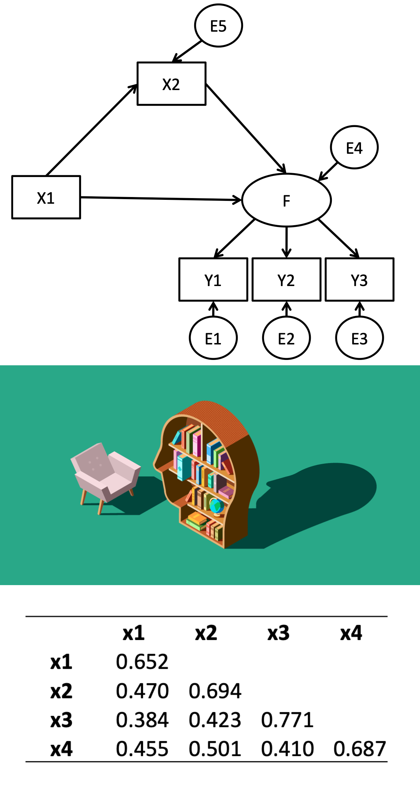
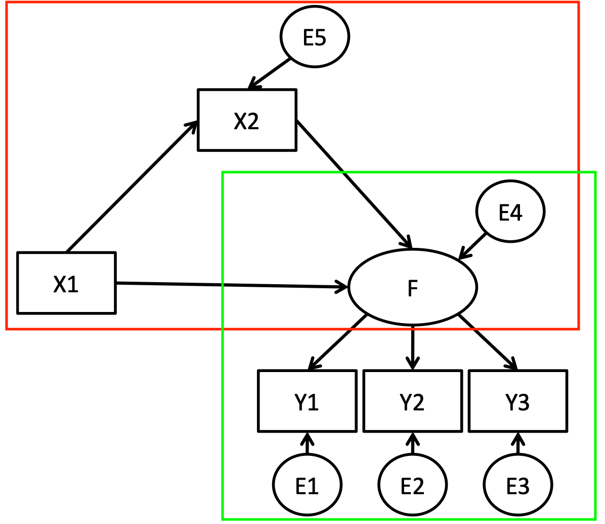
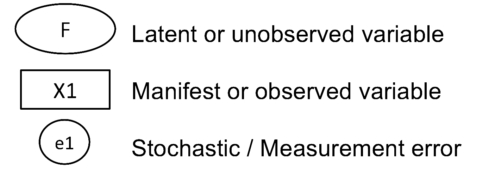
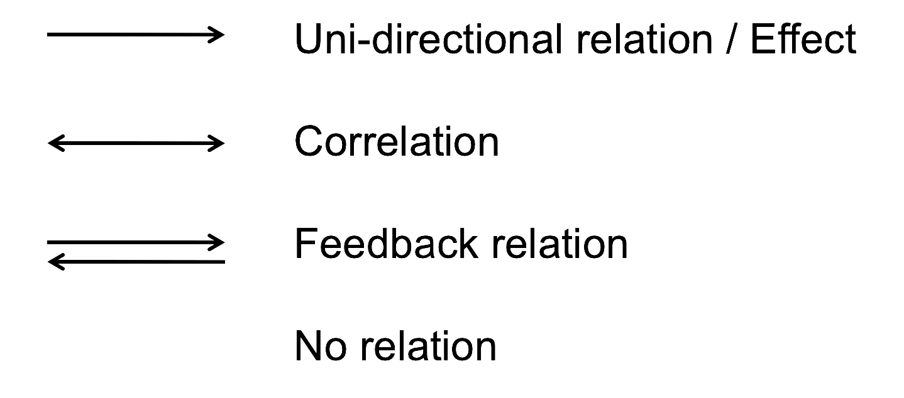
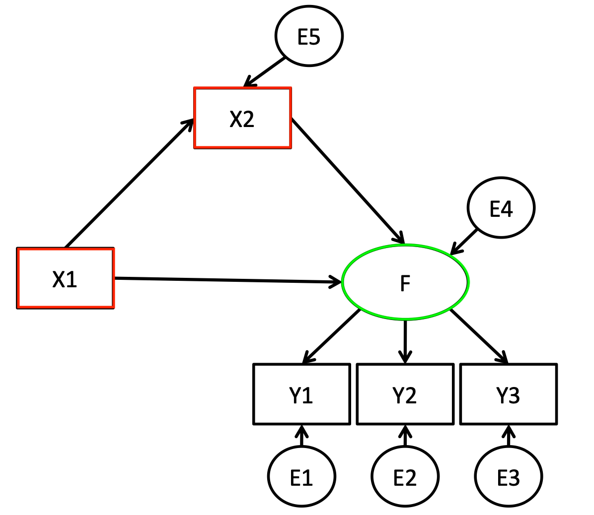

## Alberto 

- PhD Candidate at KU Leuven, Belgium
- Previously…
    - MA at Central European University 
- My research:
    - Radial Beliefs 
    - Polarization 
    - Liberal Values 
    - Methods: Causality, experimental and semi-experimental design, SEM etc.
- Contact: alberto.stefanelli@kuleuven.be
- Website: www.albertostefanelli.com
- Twitter: `@sergsagara`


## Your turn 

- Name?
- Research interests?
- Previous experience with SEM?
- Previous experience with R?
- Why are you taking this workshop?

## Suggested readings

1. Kline, R.B. (2016).Principles and practices of structural equation modeling. Guilford: New York.
2. Zhao, Xinshu et al. (2010). “Reconsidering Baron and Kenny: Myths and Truths about Mediation Analysis.” Journal of Consumer Research 37 (2): 197–206.
4. Brown, T.A. (2015). Confirmatory Analysis for Applied Research.

## What we are going to cover 


1. 15.15 - 16.20
    - Into to SEM. What it is ?
    - Estimation basics
    - Path modelling 
    - Exercise 
    - Equivalent models
2. 16.30 - 17.00
    - Fit MIMIC and mediation modesl in R. 
    - Wrap up 

## What is SEM (1)?

\centering
{height=80%} \hspace{1cm}\hspace{1cm} {height=80%}


## What is SEM (2)?

- Multivariate analytical technique: to gain insight in the relations between multiple variables
- Example: how are education, income, and threat related?

## What is SEM (3)?

Rather than single equations, *systems of equations* are modelled

- OLS: $$
Y=\beta0 + \beta1X1 +\beta2X2 + \epsilon
$$

- SEM: $$
\begin{aligned}
& Y1=\lambda1F + \epsilon1 \\
& Y2=\lambda2F + \epsilon2 \\
& Y3=\lambda3F + \epsilon3 \\
& F= \beta1X1 +\beta2X2 + \epsilon4 \\
& X2=  \beta3X1 + + \epsilon5
\end{aligned}
$$

## What is SEM (4)? 

Typically consists of two components that represent different sets of equations (full SEM):

::: columns

:::: column
1. \textcolor{green}{Measurement model:} relations between indicators and hypothetically observed constructs, that cannot be measured directly
    - Latent variable estimation: concept measured by multiple indicators that contain measurement error (random & non-random)
2. \textcolor{red}{Structural model:} effects between variables. 
      - Can be direct, indirect, conditional...
::::

:::: column

\centering

\vspace{1cm}
{height=50%}

::::

:::

      
## Advantages of SEM? 

- Estimate relations between latent variables instead of between unreliable indicators
- Test of complex relationships between variables (e.g., multiple DVs, mediation, moderation, multi-group)
- Handle different types of variables in the same model (i.e., nominal, ordinal, continuous)
- Can handle equality constrains between different parameters of the model 
- Extensive set of fit measure to evaluate model performance 
- Can be expanded "easily" to more complex data structures (e.g., multilevel modelling, latent growth modelling)

## Graphical Notation

Graphically visualize the relationship (paths) between the variables included in the model. 

::: columns

:::: column
Types of variables 
{height=50%}

::::

:::: column

Types of relationships 

{height=50%}


::::

:::

## SEM Notation


::: columns

:::: column
1. \textcolor{red}{Exogenous Variables:} means "from without (the outside)". Variable that are not explained by the model for which causes are unknown as far as the model is concerned.
2. \textcolor{green}{Endogenous Variables:} means "from within". Variables that are explained by the model and have at least one cause Usually placed in the left side of the diagram. 
::::

:::: column

\centering

\vspace{1cm}
{height=50%}

::::

:::

## Model estimation (1)

Instead of raw data (rows=observations), SEM uses the variance covariance matrix to estimate model parameters. 

```{r, echo=FALSE, message=FALSE, warning=FALSE}

library(dplyr)
ess_df <- haven::read_sav("https://github.com/albertostefanelli/SEM_labs/raw/master/data/ESS4_belgium.sav")

ess_df$Egalitarianism <- round((ess_df$gincdif + ess_df$dfincac + ess_df$smdfslv)/3,0)

ess_df_selected <- ess_df |> select(
                  ## Egalitarianism ##
                  Egalitarianism,
                  ## Demographics ##
                  agea, 
                  eduyrs,


)

head_10 <- head(ess_df_selected,10)

names(head_10)[2:3] <- c("Age","Education")
```


::: columns

::::column

```{r, echo=FALSE, message=FALSE, warning=FALSE}
library(knitr)
kable(head_10)
```
::::

:::: column

\vspace{1cm}\vspace{1cm}

```{r, echo=FALSE, message=FALSE, warning=FALSE, out.width="30%"}
library(kableExtra)

kable(round(cov(head_10),2),format="latex", booktabs=TRUE) %>% 
  kable_styling(latex_options="scale_down")

```
::::

:::


## Model estimation (2)

Parameter estimation:

- Every set of parameters implies a certain variance-covariance (and mean structure) matrix $\Sigma$
- SEM comes down to estimate the parameters so that they approach the sample observed variance-covariance matrix $S$ as good as possible 
- Distance between the two matrices is evaluated based on a fit function


Most frequently used is Maximum Likelihood Estimation:

- $F_{ML}= ln|S| - ln|\Sigma| + tr[(S)(\Sigma^-1)] - p$ with p equal to the order of the input matrix
- If $S = \Sigma$
    - the logs of the determinants are equal
    - and $|S| X |\Sigma|$ is the identity matrix with trace p 
    - the fit function is equal to 0

## Model estimation (3)

The fit function is minimized by means of an iterative procedure

- Point of departure: set of starting values for the parameters
- Step 1: Evaluate the fit function
- Step 2: Modify parameters in the direction of a better fit (till convergence)
- Step 3: Evaluate the improvement in the fit function (till convergence)

## Model fit evaluation

- Chi-square ‘goodness of fit’ test
    - Tests whether the assumed linear structure holds in the population
    - If chi-square value is statistically significant, reject the model
    - Degrees of freedom: $p(p+1)/2$
    - sensitive for large sample sizes and deviations from multivariate normality
- Standardized Mean Square Residual (SRMR): square root of the average discrepancy between implied and observed covariance
    - Between 0 and 1, smaller values indicating a better fit
    - Rule of thumb: <.08 indicates acceptable fit
- Comparative Fit Index (CFI)
    - $CFI= \frac{(\chi^2- df)_{NullModel} - (\chi^2- df)_{EstimatedModel}}{(\chi^2- df)_{Null Model}}$
    -  Evaluates the fit of your model compared to the independence model
    - Range 0-1; higher values indicating a better fit
    - Rule of thumb: >.9 indicates acceptable fit
- There are others (e.g. RMSEA, TLI) but they are similar to the one presented 


## Path modelling

Path analysis is a form of multiple regression analysis that is used to examine the relationships between variables. It is useful to decompose the effect of a variable into different 'path' or 'components' with the goal of understanding how different variables influence our outcome(s) of interest. 

::: columns

:::: column

Traditional regression analysis

- 1 DV
- 1 or more IVs 


```{r, echo=FALSE, message=FALSE, warning=FALSE, out.width="80%"}

library(tidySEM)
library(latex2exp)
library(tikzDevice)

edg <- data.frame(from = c("X1", "Y1"),
                  to = c("Y2", "Y2"),
                  #label= c("Beta3","Beta2","Beta1", "E2", "E1"),
                  size = 1.5,
                  label_size = 6


)

nod <- data.frame(name = c("X1","Y1", "Y2"),
                    shape = c("rect", "rect","rect"),
                    label= c("Staying \n at home (IV)","Isolation \n (IV)","Depression \n (DV)"),
                    linetype = c(1,1,1),
                    size = c(1.5),
                    # colour = c("blue", "blue"),
                    # fill = c("blue", "blue"),
                    # size = c(2, 2),
                     alpha = .5,
                     label_size = 6

                  )

graph_sem(edges = edg, 
          nodes = nod, 
          layout = get_layout("", "Y1", "",
                             "X1","","Y2",
                             rows = 2),
           rect_height = 0.5,
           rect_width = 1.1,
           variance_diameter = 0.4,
           angle = 170
          )

```


::::

:::: column

Path modelling

- Multiple DVs
- 1 or more IVs 
- 1 or more mediators 

```{r, echo=FALSE, message=FALSE, warning=FALSE, out.width="80%"}

library(tidySEM)
library(latex2exp)
library(tikzDevice)

edg <- data.frame(from = c("X1", "X1", "Y1"),
                  to = c("Y1", "Y2", "Y2"),
                  #label= c("Beta3","Beta2","Beta1", "E2", "E1"),
                  size = 1.5,
                  label_size = 6


)

nod <- data.frame(name = c("X1","Y1", "Y2"),
                    shape = c("rect", "rect","rect"),
                    label= c("Staying \n at home (IV)","Isolation \n (??)","Depression \n (DV)"),
                    linetype = c(1,1,1),
                    size = c(1.5),
                    # colour = c("blue", "blue"),
                    # fill = c("blue", "blue"),
                    # size = c(2, 2),
                     alpha = .5,
                     label_size = 6

                  )

graph_sem(edges = edg, 
          nodes = nod, 
          layout = get_layout("", "Y1", "",
                             "X1","","Y2",
                             rows = 2),
           rect_height = 0.5,
           rect_width = 1.1,
           variance_diameter = 0.4,
           angle = 170
          )

```


::::

:::


## Correspondence between graphical and mathematical notation 


::: columns

:::: column

\vspace{1cm}

$$
\begin{aligned}
& Y1= \gamma_{11}X1 + \epsilon1 \\
& Y2= \gamma_{21}X1 + \beta_{21}Y1 + \epsilon2 
\end{aligned} 
$$


$$
\begin{bmatrix}
Y1 \\ 
Y2 
\end{bmatrix} =
\begin{bmatrix}
\gamma_{11} \\ 
\gamma_{21} 
\end{bmatrix} 
\begin{bmatrix}
X1
\end{bmatrix} +
\begin{bmatrix}
0 & 0 \\ 
\beta_{21} & 0 
\end{bmatrix} 
\begin{bmatrix}
Y1 \\
Y2 
\end{bmatrix} +
\begin{bmatrix}
\epsilon1 \\ 
\epsilon2 
\end{bmatrix}
$$
$$Y = \Gamma X + \beta Y + E$$


::::

:::: column


```{r, echo=FALSE, message=FALSE, warning=FALSE, out.width="80%"}

library(tidySEM)
library(latex2exp)
library(tikzDevice)

edg <- data.frame(from = c("X1", "X1", "Y1", "Y1", "Y2"),
                  to = c("Y1", "Y2", "Y2",   "Y1", "Y2"),
                  label= c("Gamma11","Gamma21","Beta21", "E2", "E1"),
                  size = 1.5,
                  label_size = 6


)

nod <- data.frame(name = c("X1","Y1", "Y2"),
                    shape = c("rect", "rect","rect"),
                    label= c("X1","Y1","Y2"),
                    linetype = c(1,1,1),
                    size = c(1.5),
                    # colour = c("blue", "blue"),
                    # fill = c("blue", "blue"),
                    # size = c(2, 2),
                     alpha = .5,
                     label_size = 6

                  )

graph_sem(edges = edg, 
          nodes = nod, 
          layout = get_layout("", "Y1", "",
                             "X1","","Y2",
                             rows = 2),
           rect_height = 0.5,
           rect_width = 1.1,
           variance_diameter = 0.4,
           angle = 170
          )

```


::::

:::

## Effect decomposition 

::: columns

:::: column

1. Direct effect $\gamma_{21}$
2. Indirect effect $\gamma_{11} \times \beta_{21}$
3. Total effect: Direct effect $\gamma_{21}$ +  Indirect effect $\gamma_{11} \times \beta_{21}$


::::

:::: column


```{r, echo=FALSE, message=FALSE, warning=FALSE, out.width="80%"}

library(tidySEM)
library(latex2exp)
library(tikzDevice)

edg <- data.frame(from = c("X1", "X1", "Y1", "Y1", "Y2"),
                  to = c("Y1", "Y2", "Y2",   "Y1", "Y2"),
                  label= c("Gamma11","Gamma21","Beta21", "E2", "E1"),
                  size = 1.5,
                  label_size = 6


)

nod <- data.frame(name = c("X1","Y1", "Y2"),
                    shape = c("rect", "rect","rect"),
                    label= c("X1","Y1","Y2"),
                    linetype = c(1,1,1),
                    size = c(1.5),
                    # colour = c("blue", "blue"),
                    # fill = c("blue", "blue"),
                    # size = c(2, 2),
                     alpha = .5,
                     label_size = 6

                  )

graph_sem(edges = edg, 
          nodes = nod, 
          layout = get_layout("", "Y1", "",
                             "X1","","Y2",
                             rows = 2),
           rect_height = 0.5,
           rect_width = 1.1,
           variance_diameter = 0.4,
           angle = 170
          )

```


::::

:::


## Exercise (1): 


::: columns

:::: column


Tasks: 

1. \textcolor{red}{Exogenous variables}?
2. \textcolor{green}{Endogenous variables}?
3. Write out the set of equations [skip the matrix notation]
4. Count the number of information present in the sample-implied var-cov matrix
5. Count the number of parameters to estimate 
6. Which paths are not estimated ?
7. Write out the indirect effects 

::::

:::: column


```{r, echo=FALSE, message=FALSE, warning=FALSE, out.width="80%"}

library(tidySEM)
library(latex2exp)
library(tikzDevice)

edg <- data.frame(from = c("Age", "Gender", "Gender", "Religiosity", "Threat","Religiosity"),
                  to = c("Religiosity", "Religiosity", "Threat", "Threat","Threat","Religiosity"),
                  #label= c("Beta3","Beta2","Beta1"),
                  size = 1.5,
                  label_size = 6


)

nod <- data.frame(name = c("Age","Gender", "Religiosity","Threat" ),
                    shape = c("rect", "rect","rect","rect"),
                    label= c("Age \n (X2)","Gender \n (X1)","Religiosity \n (Y1)","Threat \n (Y2)"),
                    linetype = c(1,1,1,1),
                    size = c(1.5),
                    # colour = c("blue", "blue"),
                    # fill = c("blue", "blue"),
                    # size = c(2, 2),
                     alpha = .5,
                     label_size = 6

                  )

graph_sem(edges = edg, 
          nodes = nod, 
          layout = get_layout("Age", "", "Threat",
                             "Gender","Religiosity","",
                             rows = 2),
           rect_height = 0.5,
           rect_width = 1.1,
           variance_diameter = 0.4,
           angle = 170
          )

```


::::

:::


## Solutions (1) 


1. \textcolor{red}{Exogenous variables}: Gender, Age
2. \textcolor{green}{Endogenous variables}: Threat, Religiosity
3. Pieces of info: 10

$$\begin{aligned}\sigma(X_{1...4})\\cov(X1,X2)\\cov(X1,X3)\\cov(X1,X4)\\cov(X2,X3)\\cov(X2,X4)\\cov(X3,X4)\end{aligned}$$

## Solutions (2) 


::: columns

:::: column


4. Parameters to estimate: 8$$
\begin{aligned}&\sigma_{age}, \sigma_{gender}\\ &\epsilon_1,\epsilon_2\\ &\beta_{21}\\ &\gamma_{11} \gamma_{21} \gamma_{12}\end{aligned}
$$
5. Equations:$$
\begin{aligned}
Religiosity= \gamma_{11}Gender + \gamma_{12}Age + \epsilon_1 \\
Threat= \gamma_{21}Gender+ \beta_{21}Religiosity + \epsilon_2
\end{aligned}
$$
6. Paths not estimated: $\beta_{32}Age, \gamma_{22}Age$
7. Indirect effects: $$\gamma_{12}Age \times \beta_{21}Religiosity, \gamma_{11}Gender \times \beta_{21}Religiosity$$

::::

:::: column


```{r, echo=FALSE, message=FALSE, warning=FALSE, out.width="80%"}

library(tidySEM)
library(latex2exp)
library(tikzDevice)

edg <- data.frame(from = c("Age",        "Gender",    "Gender",  "Religiosity","Threat", "Religiosity", "Age", "Gender"),
                  to = c("Religiosity", "Religiosity", "Threat", "Threat",     "Threat", "Religiosity","Age", "Gender"),
                  label= c("gamma12","gamma11","gamma21", "beta21", "E2", "E1", "sigma1", "sigma2"),
                  size = 1.5,
                  label_size = 6


)

nod <- data.frame(name = c("Age","Gender", "Religiosity","Threat" ),
                    shape = c("rect", "rect","rect","rect"),
                    label= c("Age \n (X2)","Gender \n (X1)","Religiosity \n (Y1)","Threat \n (Y2)"),
                    linetype = c(1,1,1,1),
                    size = c(1.5),
                    # colour = c("blue", "blue"),
                    # fill = c("blue", "blue"),
                    # size = c(2, 2),
                     alpha = .5,
                     label_size = 6

                  )

graph_sem(edges = edg, 
          nodes = nod, 
          layout = get_layout("Age", "", "Threat",
                             "Gender","Religiosity","",
                             rows = 2),
           rect_height = 0.5,
           rect_width = 1.1,
           variance_diameter = 0.4,
           angle = 170
          )

```


::::
:::

## Assumptions

1. Relations among the variables must be linear
2. Errors 
    - Constant variance (Homoscedasticity)
    - Covariances among the disturbance terms are zero (equivalent to the assumption of uncorrelated errors among the predictor variables in regression)
    - Multivariate normality of residuals 
4. No specification error (aka, no omitted variables)

## Equivalent models (1)

Sometimes path analysis is called "causal modelling." However, the word "causal" refers to an assumption of the model rather than an intrinsic property of path analysis. To make a causal claim, the model needs to be causally identified. 


```{r, echo=FALSE, message=FALSE, warning=FALSE, out.width="80%"}
library("lavaan")
library(tidySEM)
set.seed(66)

Modsim <- '
B ~ 0.5*A + -0.9*C 
C ~ 0.1*A
'

Data <- simulateData(Modsim)
###

col.order <- c("A","B","C")

ModA <- '
B ~ A + C 
C ~ A
'

fitA <- sem(ModA, Data, sample.nobs = 500)


ModB <- '

A ~ C + B
B ~ C 
'

fitB <- sem(ModB, Data, sample.nobs = 500)


ModC <- '
A ~ B
C ~ A + B
'

fitC <- sem(ModC, Data, sample.nobs = 500)


```

:::::: {.cols data-latex=""}

::: {.col data-latex="{0.333\textwidth}"}

\centering
*Model: Mediator A*
```{r, echo=FALSE, message=FALSE, warning=FALSE, out.width="100%"}
graph_sem(fitC, layout = get_layout("A","B",
                                    "C","",
rows = 2),
           rect_height = 0.5,
           rect_width = 1.1,
           variance_diameter = 0.4,
           angle = 170,          text_size = 8


)
```


:::

::: {.col data-latex="{0.333\textwidth}"}
\centering
*Model: Mediator B*

```{r, echo=FALSE, message=FALSE, warning=FALSE, out.width="100%"}
graph_sem(fitB, layout = get_layout("A","B",
                                    "C","",
rows = 2),
           rect_height = 0.5,
           rect_width = 1.1,
           variance_diameter = 0.4,
           angle = 170,          text_size = 8

)

```
:::

::: {.col data-latex="{0.333\textwidth}"}
\centering
*Model: Mediator C*
```{r, echo=FALSE, message=FALSE, warning=FALSE, out.width="100%"}

graph_sem(fitA, layout = get_layout("A","B",
                                    "C","",
rows = 2),
           rect_height = 0.5,
           rect_width = 1.1,
           variance_diameter = 0.4,
           angle = 170,
          text_size = 8

)
```
:::
::::::

## Equivalent models (2)

:::::: {.cols data-latex=""}

::: {.col data-latex="{0.333\textwidth}"}

\centering
*Model implied variance-covariance for Model: Mediator A*
```{r, echo=FALSE, message=FALSE, warning=FALSE, out.width="100%"}
kable(round(lavInspect(fitA, "sigma")[col.order,col.order],2), format="latex", booktabs=TRUE) %>% 
  kable_styling(latex_options="scale_down")

```

:::

::: {.col data-latex="{0.333\textwidth}"}
\centering
*Model implied variance-covariance for Model: Mediator B*

```{r, echo=FALSE, message=FALSE, warning=FALSE, out.width="100%"}
kable(round(lavInspect(fitB, "sigma")[col.order,col.order],2), format="latex", booktabs=TRUE) %>% 
  kable_styling(latex_options="scale_down")

```
:::

::: {.col data-latex="{0.333\textwidth}"}
\centering
*Model implied variance-covariance for Model: Mediator C*
```{r, echo=FALSE, message=FALSE, warning=FALSE, out.width="100%"}
kable(round(lavInspect(fitC, "sigma")[col.order,col.order],2), format="latex", booktabs=TRUE) %>% 
  kable_styling(latex_options="scale_down")
```
:::
::::::

## Equivalent models (3)

Two or more models, with the same variables are equivalent if:

1. Same conditional independence relationships
2. Have the same fit 
3. Have the same number of degrees of freedom
4. Are saturated 

Equivalent models can not be distinguished in statistical ways. Theory is your best friend !!


